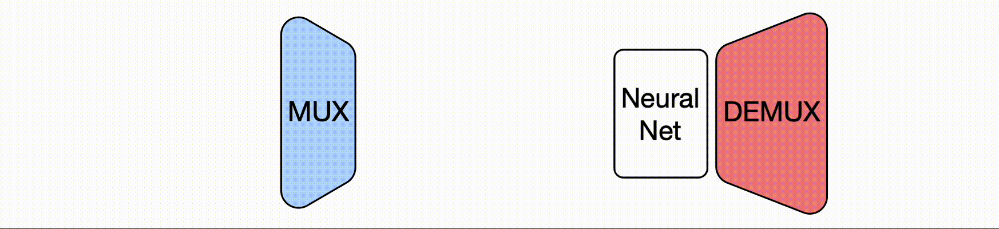

## Abstract
In this work, we show that deep neural networks are capable of generating accurate predictions over *mixtures* of inputs. We introduce data multiplexing (DataMUX), a novel technique that enables networks to process multiple inputs simultaneously using a single compact representation, resulting in increased throughput with minimal extra space requirements. Our approach uses two key components -- a *multiplexing* layer that performs a fixed linear transformation to each input before combining them to create a single `mixed' representation which is processed by the base network, and a *demultiplexing* layer that converts the network's output back into independent representations before producing predictions for each input. We demonstrate the viability of DataMUX for multiple architectures (Transformers, and to a lesser extent MLPs and CNNs) across six different tasks spanning sentence classification, named entity recognition and image classification. For instance, DataMUX for Transformers can multiplex up to 20x/40x, achieving 11x/18x throughput with minimal absolute performance drops of <2% and <4%, respectively over a standard Transformer on MNLI, a natural language inference task.We also provide a theoretical construction for multiplexing in self-attention networks and analyze the effect of various design elements in DataMUX.

## Multiplexing for the Transformer
<div style="text-align: center;">

</div>

Illustration of DataMUX applied to a Transformer model. Given a tuple of $N$ sentences ($x^1, x^2, \dots, x^N$), each of length $L$, we first apply a multiplexing operation which performs a transformation $\phi^i$ on the embeddings of each sequence $x^i$, such that the same transformation is applied to every token in a sequence $x^i$. The multiplexing operation then aggregates the sequences by averaging over each position, generating a single combined sequence $\mathbf{x}^{1:N}\in\mathbb{R}^{L\times d}$, for embedding size $d$, which will be passed on to the central Transformer model. After processing, we perform a demultiplexing operation to the Transformer model's output $\mathbf{h}^{1:N}\in\mathbb{R}^{L\times d}$, to generate hidden representations $\mathbf{h}^1, \mathbf{h}^2, \dots, \mathbf{h}^N$, corresponding to inputs $x^1, x^2, x^N$ respectively. We finally use these hidden representations to generate predictions for a particular task (e.g. named entity recognition (NER)) using a shared task prediction head.


## Authors
<div class="container">
    <figure>
    <a href="https://vishvakmurahari.com"></a>
        <figcaption><a href="https://vishvakmurahari.com">Vishvak Murahari</a></figcaption>
    </figure>
    <figure>
    <a href="http://carlosejimenez.com/"></a>
        <figcaption><a href="http://carlosejimenez.com/">Carlos E. Jimenez</a></figcaption>
    </figure>
    <figure>
    <a href="https://runzhe-yang.science"></a>
        <figcaption><a href="https://runzhe-yang.science">Runzhe Yang</a></figcaption>
    </figure>
    <figure>
    <a href="https://www.cs.princeton.edu/~karthikn/"></a>
        <figcaption><a href="https://www.cs.princeton.edu/~karthikn/">Karthik Narasimhan</a></figcaption>
    </figure>
</div>

### Citation

```
@article{datamux
  title={DataMUX: Data Multiplexing for Neural Networks,
  author={Vishvak Murahari and Carlos E. Jimenez and Runzhe Yang and Karthik Narasimhan},
  journal={arXiv preprint arXiv:TODO},
  year={2022},
}
```

